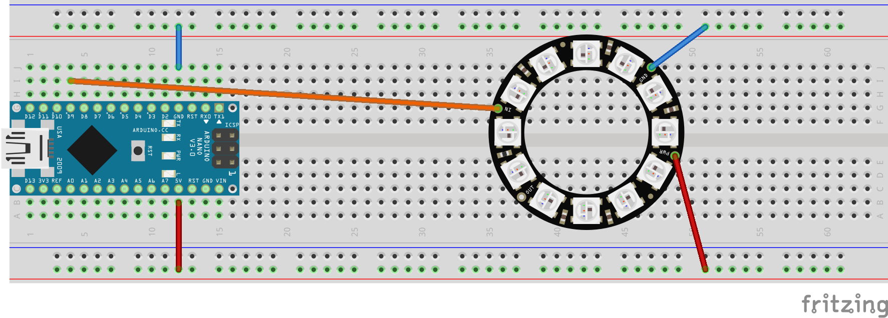

= Iron man's chest light

[[schematics]]
.Breadboard  of Iron man's chest light

== Getting started

The sketch `IronMansChestLight.ino` is a simple example do demonstrate how to drive
a https://en.wikipedia.org/wiki/Adafruit_Industries#NeoPixel[NeoPixel], the
individually-addressable red-green-blue (RGB) LED from https://www.adafruit.com/[Adafruit Industries].

The example depends on the Software Library `Adafruit_NeoPixel`. You need to install that
library before to be able to successfully build and download it.

To do so you may refer to

* https://learn.adafruit.com/adafruit-neopixel-uberguide/arduino-library-installation

== Walkthrough the example
A NeoPixel is driven through an object of class `Adafruit_NeoPixel` which is defined
inside the library `Adafruit_NeoPixel`,

We do the configuration when instantiating the object. Here we set the

* *number of LEDs*,
* *pin* on the Arduino the NeoPixel is connected to and also the
* *type* of NeoPixel (color and frequency).

According schematics <<schematics>> our NeoPixel carrys 12 pixels and is connected
to *pin-9*.

During the program we drive the NeoPixel by calling methods (aka functions) of the object:

* `begin`,
* `setBrightness`,
* `setPixelColor`,
* `show`

Command `begin` is initializes the object, meaning making it ready for
further usage. Command `show` actually "publishes" the values we have set by using `setBrightness`
and `setPixelColor`.

Command `setBrightness` effects *all* pixels. Command `setPixelColor` addresses exact one pixels
by its position in the chain.

We also use functions

* `numPixels`

to get the number of Pixels when we need to know that (in the loop). To keep this in mind
by a global variable would also work. But how we did it is much sleeker.

Further reading: Adafruit's page also provides a very nice documentation on how to *use* the library:

* https://learn.adafruit.com/adafruit-neopixel-uberguide/arduino-library

== Hints
You can daisy chain Neopixels by connecting others to the *out-pin* of the previous one.

Before adding more than, let's say 30, pixels, you should use an other source for the `VCC`
of the NeoPixel. In that case make sure that the ground pins (`GND`) resp. wires of

* Arduino,
* Additional power source and also
* NeoPixel

are all connected.

Each of the pixels draws a certain amount of *electrical current* from the power pin.
In the example we've connected the power pin of the NeoPixel ring to the 5V-pin of the arduino.
The current drawn from the arduino is the sum of the current of each pixel. How much current
a pin can provide is mentioned in figure <<pinout>>.

[[pinout]]
.Pinout of Arduino Nano 3.0
image::ArduinoNano3.0.png[]

Further reading: https://learn.adafruit.com/adafruit-neopixel-uberguide/power

== Making of the Breadboard schematics
The breadboard schematics has been created using the great http://fritzing.org/home/[Fritzing] program.
The source file is `IronMansChestLight.fzz`, the PNG has been exported from within Fritzing.

The NeopPixel ring comes from https://github.com/adafruit/Fritzing-Library[Fritzing-Library].
It is added to the local library by opening `AdaFruit.fzbz`.
